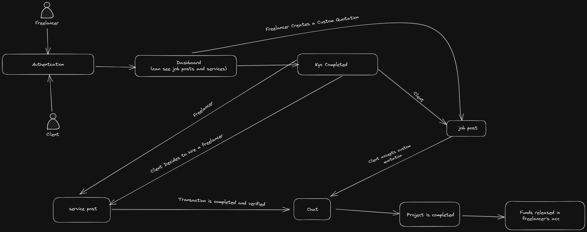

<h1 align="center">
 Lend My Skill   
  India's First Open source Freelance Platform
</h1>

A Freelance platform designed specially for Indians supporting payment methods like `Rupay Card`.

> The work is currently paused, will be continued after few meetings. 

# Table of Contents

- [Features](#features)
- [Stack Used](#stack)
- [Flow Chart](#flow-chart-of-application)
- [Contributing](#contributing)
- [Contributors](#contributors-)
- [License](#license)

# Features

- **Open Source** - This project is completely open source and you can contribute to it.

- **Payment Methods** - We are first in India to support payment methods like `Rupay Card`.
> UPI will be added soon.

# Stack

| Platform    | Stack                                                                                                                                                                                                                                                                                                                                                                                                                                                                                                                                                    |
| ----------- | -------------------------------------------------------------------------------------------------------------------------------------------------------------------------------------------------------------------------------------------------------------------------------------------------------------------------------------------------------------------------------------------------------------------------------------------------------------------------------------------------------------------------------------------------------- |
| Web         |                                                                                                                                                                                                                  |
| Backend     |      |
| Mobile Apps |                                                                                                                                                                                                                                                                                                                                                                                                                                 
# Flow Chart of Application

This is a rough flowchart of the application, it is not complete and will be updated as the project progresses.

# Contributing

All the new commits are pushed to `development` branch. If you want to contribute to this project, please create a new branch from `development` branch and create a pull request to `development` branch.

Thanks for thinking about contributing to this project, please read [Contribution Instructions](/CONTRIBUTING.md). It has all the required instructions to start this project locally. If you encounter some errors please let me know by creating an issue.

# Contributors ✨

# License

Shield: [![CC BY-NC-SA 4.0][cc-by-nc-sa-shield]][cc-by-nc-sa]

This work is licensed under a
[Creative Commons Attribution-NonCommercial-ShareAlike 4.0 International License][cc-by-nc-sa].

[![CC BY-NC-SA 4.0][cc-by-nc-sa-image]][cc-by-nc-sa]

[cc-by-nc-sa]: http://creativecommons.org/licenses/by-nc-sa/4.0/
[cc-by-nc-sa-image]: https://licensebuttons.net/l/by-nc-sa/4.0/88x31.png
[cc-by-nc-sa-shield]: https://img.shields.io/badge/License-CC%20BY--NC--SA%204.0-lightgrey.svg
